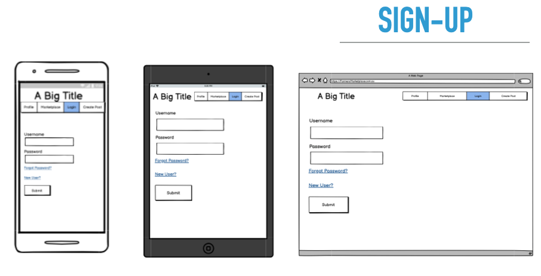
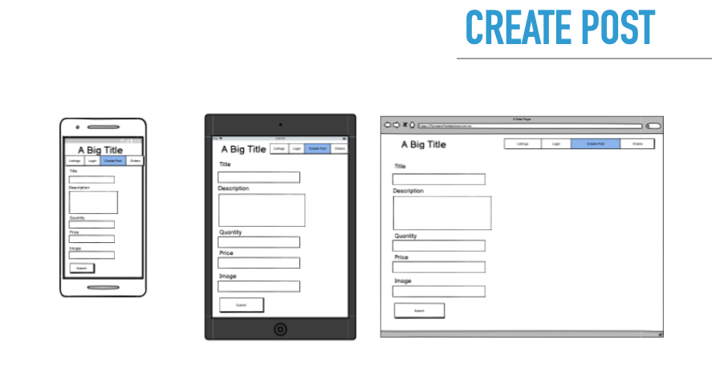
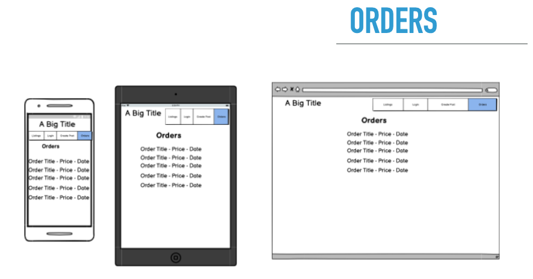

# T2A2 Marketplace Application - Christopher Baker

## Deployed Marketplace:
https://morning-hollows-06629.herokuapp.com/

## Github:
https://github.com/ChrisBaker-dev/Market

## Trello:
https://trello.com/b/sKoyITzd/marketplace#

---
# R7 - Identification of the problem you are trying to solve by building this particular marketplace app.

Large chain grocery stores create an easy and affordable way for people obtain produce but has created a market that encourages large scale farming practices which has impacted the environment and quality of food being bought.

The Farmers Marketplace application is solving two key problems:
1. It provides a place for people to purchase quality produce from local farmers to combat mass farming techniques.
2. It provides a place for people to earn income by growing produce at home.

---
# R8 - Why is it a problem that needs solving?

Due to the need for a grocery store to have their food on a shelf for a number of days, their produce is often picked prior to being fully ripe and stored at temperatures to preserve shelf life for days on end. By connecting users with their local gardeners/farmers they will not only receive a higher quality product, they will also find a lot more variety in produce than what is offered at a local grocer. 

Additional problem this application looks to solve is the amount of environmental impact industrialized has on the environment. This application aims to 
dampen the environmental impact of large scale farming techniques by utilizing community home farmers who rotate their crops within their appropriate seasons.

---
# R9 - A link to the deployed website

https://morning-hollows-06629.herokuapp.com/
---
# 10 - Link to GitHub repository.

## Github

https://github.com/ChrisBaker-dev/Market

---
# R11 - Description of your marketplace app (website)
## Purpose

Connect users with local home farmers in order to deliver better produce than can be found in a grocery store at a great price and reduce environmental impact of large scale farming practices in doing so.

## Functionality / Features

 - Sign in - Upon loading the webpage the user will be able to create a sign in, this will allow them to view the content, create produce listings make purchases and view their past orders.

 - Listings/index is the home page for farmers marketplace. It displays all relevant listings to the user and allows for navigation to other features within the marketplace.
 
- Create listing - allows for people to list their produce onto the market easily and effectively. When creating a listing, a user will be able to set their own price, quantity, add a decription and upload an image in order to market their product.

- View listing - attached to each listing is a link which allows you to view the listing. These views will allow the user to see more information on the product and allow a user to purchase the product.

- Purchase listing - processes the listing for the user and seller.

- Edit listing - allows for users to delete a listing as needed.

- View orders - this will allow a user to see their past purchases and sales.

## Future functionalities:

Farmers Marketplace has goals to create more features within its next update. These features include:

- User messaging - which will allow a user to connect with their local farmers on the platform prior to purchasing a product.

- Profiles- will allow for stronger marketing for each farmer as they can upload photos of their farm and farming processes.

- Stripe payment systems - for a more secure payment processing application, Stripe is planned to be used in future applications.

- Updated listing editing ability

## Sitemap

## Screenshots
### Login

### Listings

### Orders

## Create Listing

### Edit Listing

### View Listing

## Target Audience

This application is intended for those who would like to participate with purchasing produce from local growers as well as people who wish to get into the market as a farmer.

## Tech Stack

Front End - CSS, HTML

Back End - Ruby on Rails / PostgreSQL

Deployment Platform - Heroku

Source Control - GitHub

---
# R12 - User Stories

1. As a user, I want to be able to sign in so that I may have my actions tracked on the application.

2. As a user, I want to be able to purchase produce from farmers so that I may have higher quality food.

3. As a user, I want to be able to post products on the marketplace to be sold in order to earn income.

4. As a user, I want to be able to see past purchases so that I can track my order history.

5. As a user, I want to be able to edit posts so that I can update product information as it changes.

6. As an Administrator, I want to be able to delete listings that may conflict with terms of service so that I can ensure the website is not being used maliciously.

7. As a user, I want to be able to create a profile so I can add more details about myself.

---
# R13 - Wireframes

## Sign up

## Listings - index

## Create Listing 

## View Listing

# View Orders

---
# R14 - ERD

---
# R15 Explain the different high-level components (abstractions) in your app

The Farmers Marketplace web application has the following abstraction:

## Models:

### User:

Upon loading in the webpage the user will be asked to login or create an account before being able to access the features of the application. This model will allow the web application to track purchases, sales and listings that the user interacts with.

### Listings:

The listings model contains all of the database entries for listings that have been made on the application. User's will be able to create listings, delete listings and edit listings via the applications index page.

### Orders:

The orders model contains all of the database entries where users have bought listings. A user will be able to view their orders via a link from the listings page.

## Controllers:

### Listings: 

Farmers Marketplace will use one main controller to operate interactions within the application. This controller will give the ability for users to see relevant listings on the index page, relevant meaning listings with quantities above 0 and that don't belong to the user. Additionally it will contain, a view listing page which will give access to a user to make a purchase, create listing page containing a form to create a listing entry, an edit page for updating listings, 

### Listings Views:

index.html.erb - contains the listings and relevant links to other pages

new.html.erb - contains the form in order to create a listing

edit.html.erb - contains the form to update a listing

show.html.erb - is the view for each listing and allows direction to purchase listing

---
# R16 Detail any third party services that your app will use

This application uses two third party applications:

## Cloudinary

Cloudinary provides cloud based image management services for the application. When user upload images for their listings, these images are being stored using Cloudinaries services and provides the developers with tools on how they wish to display the images.

## Heroku

Heroku is a cloud platform as a service which supports rails in order to easily deploy rails into a live web application. Heroku also creates a new databse connection using their own services so it is no longer hosted on a local device.

---
# R17 - Describe your projects models in terms of the relationships (active record associations) they have with each other

## Models

### Listing
A isting contains all the information about a product being listed on a website. Each listing must have one and only one user_id because having 0 or more than one user_id associated to a listing will cause . Each listing can also have many orders associated with it because each listing may have a quantity greater than 1.

Listing:

    - belongs_to user
    - has_many orders

### User
The user model contains information based on the individual creating interactions within the application. User's are able to post as many listings as they want as well as purchase as many orders as they like. Therefore, a user:

    - has_many listings
    - has_many orders

### Order
The order model ontains all purchases made by a user within the web application. Each order can only belong to one user and one listing, using both of their respective model id's. An Order:

    - belongs_to user
    - belongs_to listing

---
# R18 - Discuss the database relations to be implemented in your application

The Farmers Marketplace application is using a relational database which can be shown using the ERD in R14. Each table within the application has uniquely identifiable key columns which allow for referencing data across various tables, as well as breaking up the whole of the data into smaller tables for easier management.

This can be shown by looking at the ERD from R14 in which the listings model obtains a foreign key from the user model in order to associate the listing with a user, but the listing model does not contain the user model information such as email and password. 

## Relations

    - 1 listing has many orders (1:m)
    - 1 user has many listings (1:m)
    - 1 user has many orders (1:m)

---
# R19 - Provide your database schema design

## Users schema

The Ruby gem Devise was used in order to generate the Users model and schema. This schema allows for users to provide and email and password and handles encrypting the password as well as adding a password reset token to the table.

## Listings schema

The listing model provides a user with all information in order to create a listing on the application.

## Orders schema

The orders model stores the user id's and listing id's in order to create a page for users to view their own past purchases.

## Active Storage schemas

Active storage handles image uploads for listings. 

## Foreign Keys

---
# R20 - Describe the way tasks are allocated and tracked in your project

This application made use of a Trello board in order to track user stories, features and tasks to be completed. The Trello board is broken up into 6 columns: Key, Backlog, To Do, In Progress, Testing and Completed. All user stories go into the backlog and receive tags to describe their importance and how long they will take. Once it is decided that a story will be implemented, the story will move to To Do, then In Progress when work has begun. These features are then tested and once they pass, they can be moved to completion.

Deadlines for MVP Stories:

As a user, I want to be able to sign in so that I may have my actions tracked on the application.

    -> Deadline: Monday, June 14th.

As a user, I want to be able to purchase produce from farmers so that I may have higher quality food.

    -> Deadline: Wednesday, June 16th.

As a user, I want to be able to post products on the marketplace to be sold in order to earn income.

    -> Deadline: Tuesday, June 15th

As a user, I want to be able to see past purchases so that I can track my order history.

    -> Deadline: Thursday, June 17th

As a user, I want to be able to edit posts so that I can update product information as it changes.

    -> Deadine: Thursday, June 17th

As an Administrator, I want to be able to delete listings that may conflict with terms of service so that I can ensure the website is not being used maliciously.

    -> Deadine: Friday, June 18th - non MVP

As a user, I want to be able to create a profile so I can add more details about myself.

    -> Deadline: Friday, June 18th - non MVP